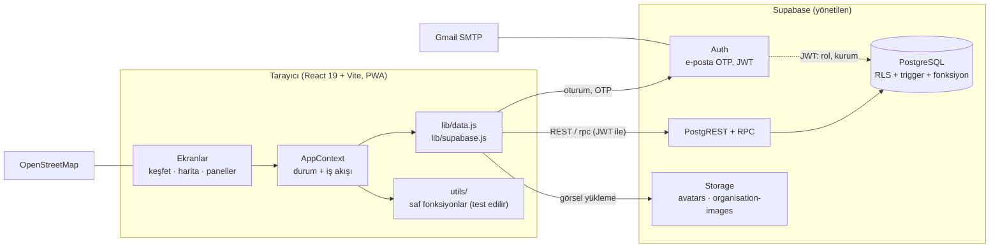
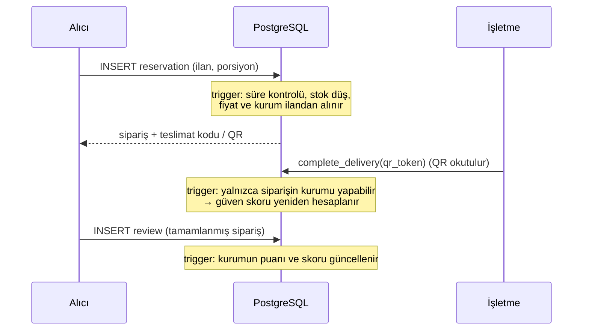

# 🌿 sosyalSorumluluk — Sıfır İsraf & Gıda Kurtarma Platformu

<div align="center">


[](https://react.dev/)
[](https://vitejs.dev/)
[](https://supabase.com/)
[](https://tailwindcss.com/)
[](https://web.dev/progressive-web-apps/)

**Gün sonunda satılmayan taze gıdayı ihtiyaç sahibiyle buluşturan sosyal sorumluluk projesi.**

[Özellikler](#-özellikler) • [Roller](#-roller) • [Mimari](#-mimari) • [Supabase Tercihi](#-neden-supabase) • [Güvenlik](#-güvenlik-modeli) • [Testler](#-test-sonuçları) • [Kurulum](#-kurulum)

</div>

---

> **Not:** Backend artık Supabase değil, `api/` klasöründeki .NET 9 API. Kurulum ve uç listesi için [api/README.md](api/README.md). Aşağıdaki Supabase bölümleri projenin ilk sürümünü anlatır.

## 📌 Amaç

Türkiye'de her yıl yaklaşık **26 milyon ton** gıda israf ediliyor. Platform, fırın, restoran, manav ve otellerde günün sonunda kalan taze gıdayı:

1. Vatandaşlara indirimli **kurtarma paketi** olarak sunar,
2. İhtiyaç sahiplerine **ücretsiz** ulaştırır,
3. Toplu fazlaları **STK ve aşevlerine** yönlendirir.

Kurtarılan gıda (kg), engellenen CO₂ ve porsiyon sayısı gerçek teslimatlardan hesaplanır. Proje, BM SKH 2 (Açlığa Son), 12 (Sorumlu Üretim ve Tüketim) ve 13 (İklim Eylemi) hedeflerine hizmet eder.

---

## ✨ Özellikler

- **E-posta kodu (OTP) ile giriş.** Parola yok. Yeni hesap her zaman alıcı olarak açılır.
- **Harita ve keşfet:** Leaflet / OpenStreetMap üzerinde yakındaki ilanlar, mesafe filtresi, ücretsiz / indirimli süzgeci.
- **Rezervasyon:** Ücretli paketlerde demo ödeme ekranı (gerçek ödeme yok, kart bilgisi kaydedilmez), sonra QR. Stok ve fiyat veritabanında atomik hesaplanır. 6 haneli teslimat kodu ve QR üretilir.
- **Teslimat onayı:** Yalnızca QR ile. İşletme, alıcının telefonundaki QR kodu **cihaz kamerasıyla** okutur. Elle kod girişi ve "teslim edildi" düğmesi yoktur.
- **Teslim saati kuralları:** Saati geçen ilan listeden kalkar ve arşivlenir. Alıcı, teslim saatinden 30 dakika öncesine kadar iptal edebilir.
- **Etki ve oyunlaştırma:** Kurtarılan kg, CO₂, rozetler, liderlik tablosu, paylaşılabilir sertifika. Hepsi tamamlanmış siparişlerden türetilir.
- **Yorum ve güven skoru:** Yorumu yalnızca teslim almış alıcı yazar. Kurumun güven skoru siparişlerden ve yorumlardan **veritabanı tarafından** hesaplanır, elle değiştirilemez.
- **Yönetim paneli:** Kurum ekleme, kuruma hesap yetkilendirme (mevcut yetkililer listelenir), logo ve kapak görseli yönetimi, kurum durumu.
- **PWA, TR/EN dil desteği, karanlık mod.**

---

## 👥 Roller

| Rol | Yapabildikleri |
| :--- | :--- |
| **Alıcı** | İlanları keşfetme, rezervasyon, QR ile teslim alma, iptal, yorum, rozet ve liderlik tablosu. |
| **İşletme** | İlan oluşturma ve porsiyon yönetimi, kendi siparişlerini görme, QR okutarak teslim onayı, kurum görsellerini düzenleme. **Rezervasyon yapamaz.** |
| **STK / Aşevi** | Toplu bağışları kabul etme. Alıcı gibi rezervasyon yapabilir. |
| **Yönetici** | Kurum ekleme ve durumu, hesap yetkilendirme, tüm görsellere erişim. İşletme adına teslim onaylayamaz, rezervasyon yapamaz. |

Roller `auth.users.raw_app_meta_data` içinde durur. İstemci bu alanı yazamaz. Rol, imzalı JWT içinde gelir ve her yetki kararını veritabanı verir (RLS).

---

## 🏗️ Mimari



**İş mantığı nerede?** Güven gerektiren her şey veritabanında, tarayıcıda yalnızca sunum ve kullanıcı kolaylığı vardır:

| Kural | Nerede zorlanır |
| :--- | :--- |
| Stok düşümü, fiyat, kurum bağı (yarış koşulsuz) | `reservations` trigger'ı (`reservation-stock.sql`) |
| Alıcı kendi siparişini "teslim edildi" yapamaz | Durum geçişi trigger'ı + RLS |
| Teslim yalnızca QR'ın gizli kodu ile onaylanır (düz `UPDATE` reddedilir) | `complete_delivery()` + durum geçişi trigger'ı (`qr-delivery.sql`) |
| Yalnızca işletme/STK/alıcı rezervasyon yapar | `reservations` insert politikası |
| Süresi geçen ilan rezerve edilemez, iptal 30 dk kuralı | `pickup-window.sql` |
| Yalnızca teslim almış alıcı yorum yazar, bir siparişe bir yorum | `reviews` politikası + benzersiz indeks |
| Güven skoru, puan ve yorum sayısı | `recompute_organisation_trust()` + kilit trigger'ı |
| Başkasının görselini değiştirememe | Storage politikası + `set_organisation_image()` |

**Veri akışı (rezervasyondan teslime):**



### Veritabanı tabloları

| Tablo | İçerik |
| :--- | :--- |
| `profiles` | Görünen ad, avatar, telefon (kullanıcı kendi satırını düzenler) |
| `organisations` | İşletme ve STK'lar, konum, görseller, hesaplanan güven skoru |
| `listings` | İlanlar: fiyat, porsiyon, teslim saatleri, durum (`active` / `archived`) |
| `reservations` | Siparişler: durum, kod, QR, teslimde sabitlenen kg/CO₂ |
| `reviews` | Teslim sonrası puan ve yorum (değiştirilemez) |

---

## 🤔 Neden Supabase?

Proje spesifikasyonu ayrı bir Node.js + Express + Prisma + Redis + S3 arka ucu ve React Native mobil uygulaması öngörüyor. Bunun yerine **yönetilen bir arka uç (Supabase)** ve PWA tercih edildi.

| Spesifikasyondaki bileşen | Bu projede karşılığı | Gerekçe |
| :--- | :--- | :--- |
| Node + Express + Prisma | Supabase PostgREST + SQL fonksiyonları / trigger'lar | Arayüz ile veritabanı arasında yazılacak ve **denetlenecek** ara katman kalmadı. |
| JWT (access + refresh), özel kimlik kodu | Supabase Auth, e-posta OTP | Parola saklama ve oturum yenileme riski yok. Rol imzalı token'da. |
| Yetkilendirme middleware'i | PostgreSQL **RLS** | Kural veriye bağlı. API'yi atlayan bir istek bile aynı politikaya takılır. |
| PostgreSQL 16 | PostgreSQL (Supabase) | Aynı motor. |
| S3 / MinIO | Supabase Storage | Aynı kova + politika modeli, ek servis yok. |
| Nodemailer + SMTP | Supabase Auth + Gmail SMTP | Aynı sonuç, kod yok. |
| React Native | PWA + mobil çerçeve (telefon simülatörü) | Tek kod tabanı, "Ana ekrana ekle", cihaz kamerasıyla QR okuma tarayıcıdan çalışıyor. |
| Redis / BullMQ (kuyruk) | Tembel arşivleme (`archive_expired_listings`) | Zamanlayıcı gerektirmez. İlan yüklenirken süresi geçenler arşivlenir. |
| Jest + Supertest | Vitest | Vite ile aynı araç zinciri. |

Sonuç: ekip küçükken daha az hareketli parça, ve güvenlik kuralları uygulama kodundan çıkıp **veritabanına** taşındı. Bunun bedeli de var: Socket.IO ile anlık bildirim, push bildirimi, ayrı API dokümantasyonu (Swagger) ve yerel mobil uygulama kapsam dışı kaldı. Bkz. [Bilinen Sınırlar](#-bilinen-sınırlar).

---

## 🔒 Güvenlik Modeli

- Tüm tablolarda **RLS açık**. Anahtar olarak yalnızca *publishable* anahtar istemcide bulunur, `service_role` hiçbir yerde yok.
- Yetki bilgisi (`role`, `organisation_id`) `app_metadata`'da. Kullanıcı kendi rolünü değiştiremez. Yetkiyi yalnızca yönetici, `grant_organisation_access()` fonksiyonu ile verir.
- Fiyat, stok, kurum ve yazar adı istemciden değil veritabanından gelir.
- Bir kurum, **başka kurumun** siparişini göremez, ilanını ve görselini değiştiremez. Alıcı, kendi siparişini tamamlayamaz (canlı API'ye `PATCH` ile denendi, `P0001` hatası döndü).
- Güven skoru API'den yazılamaz. Kilit trigger'ı yalnızca `authenticated`/`anon` rollerini engeller.
- Görsel yüklemede tür (JPG/PNG/WebP) ve boyut (2 MB) kovada zorlanır. SVG bilinçli olarak yasak.
- `.env` git dışında tutulur, örneği `.env.example` dosyasındadır.

---

## 🧪 Test Sonuçları

CI (GitHub Actions) her `push` ve `pull request`'te `lint → test → build` çalıştırır.

| Kontrol | Sonuç |
| :--- | :--- |
| `npm run lint` (ESLint) | Sıfır uyarı, sıfır hata |
| `npm test` (Vitest) | **6 dosya, 64 test, hepsi geçti** |
| `npm run build` (Vite) | Başarılı |

**Birim testleri (64)**

| Dosya | Test | Kapsam |
| :--- | :---: | :--- |
| `security.test.js` | 30 | rol/panel yetki matrisi, kurum sahipliği, metin ve sayı temizleme, mesafe ve konum kaydırma, güvenli rastgele kod |
| `notifications.test.js` | 8 | bildirimlerin siparişten türetilmesi, göreli zaman |
| `impact.test.js` | 9 | etki toplamı, rozet ve seviye eşikleri |
| `pickupWindow.test.js` | 8 | ilan süresi, Türkiye saatine göre gün, 30 dakikalık iptal sınırı |
| `orgStats.test.js` | 5 | işletme panelindeki kg, CO₂, gelir ve aylık dağılımın tamamlanan siparişlerden hesaplanması |
| `payment.test.js` | 4 | demo ödeme ekranında kart numarası (16 hane) ve son kullanma doğrulaması |

**Elle yapılan uçtan uca testler** (iki ayrı hesapla, gerçek Supabase projesinde)

| Senaryo | Sonuç |
| :--- | :--- |
| İkinci hesapla rezervasyon yap, birinci hesapta görünmemeli | Geçti |
| Alıcı kendi siparişini `completed` yapamamalı (canlı API) | Geçti: `Bu durum değişikliği için yetkiniz yok` |
| Yönetici hesap yetkilendirir, hesap işletme paneline girer | Geçti |
| İşletme yalnızca kendi siparişlerini görür | Geçti |
| Rezervasyon yetki testleri SQL ile (RLS, `request.jwt.claims`) | Geçti |

> Veritabanı kuralları (trigger, politika) otomatik testlerle değil, yukarıdaki elle yapılan senaryolarla ve SQL ile doğrulandı. Otomatik uçtan uca (E2E) test yok.

---

## 🚀 Kurulum

```bash
git clone https://github.com/nazimhikmetsasi/sosyalSorumluluk.git
cd sosyalSorumluluk
npm install
copy .env.example .env      # macOS/Linux: cp .env.example .env
npm run dev                 # http://localhost:3000
```

`.env` içine Supabase proje adresini ve **publishable** anahtarı yazın:

```
VITE_SUPABASE_URL=https://<proje-ref>.supabase.co
VITE_SUPABASE_ANON_KEY=sb_publishable_...
```

Yeni bir Supabase projesinde `supabase/` klasöründeki dosyalar şu sırayla, SQL Editor'da çalıştırılır:

1. `schema.sql` — profiller, kimlik yardımcıları
2. `profile-storage.sql` — avatar deposu
3. `data-schema.sql` — kurumlar, ilanlar, rezervasyonlar, RLS
4. `seed-data.sql` — örnek veri
5. `reservation-stock.sql` — stok ve fiyat trigger'ı
6. `impact-columns.sql` — kg / CO₂ kaydı
7. `aggregates.sql` — liderlik tablosu, platform sayaçları
8. `organisation-admin.sql` — kurum yetkili listesi
9. `organisation-images.sql` — logo ve kapak görselleri
10. `reviews.sql` — yorumlar ve hesaplanan güven skoru
11. `trust-score-lock.sql` — türetilen sütunları API'ye kapatır
12. `pickup-window.sql` — süresi dolan ilan, iptal sınırı
13. `qr-delivery.sql` — teslimi yalnızca QR ile onaylatır
14. `public-stats.sql` — giriş ekranındaki toplam sayıları oturumsuz okunabilir yapar

İsteğe bağlı: `seed-bursa.sql` — Bursa'da bugüne göre saatlenmiş örnek kurum ve ilanlar (liste boşsa çalıştırın).

İlk yönetici SQL ile atanır (rol istemciden verilemez):

```sql
update auth.users
   set raw_app_meta_data = coalesce(raw_app_meta_data, '{}'::jsonb) || '{"role":"admin"}'::jsonb
 where email = 'yonetici@eposta.com';
```

---

## ⚠️ Bilinen Sınırlar

- **Mobil:** Yerel (React Native) uygulama yok. Telefon çerçevesi bir simülatördür, gerçek deneyim PWA'dır.
- **Bildirim:** Anlık (Socket.IO) ve push bildirimi yok. Bildirimler sayfa yüklenince siparişlerden türetilir.
- **Gelmeyen alıcı (no-show):** Otomatik işlem yok. Teslim edilmeyen siparişler `confirmed` kalır.
- **Arşivleme tembel:** Zamanlayıcı yok. Süresi geçen ilan, uygulama veri yüklerken arşivlenir.
- **Örnek veri tek günlüktür:** Örnek ilanlar kayıt günü içinde teslim saatini geçer, ertesi gün listeden kalkar. İşletmeler yeni ilan açmalı.
- **Ödeme sahtedir:** Ödeme ekranı yalnızca arayüz akışını gösterir, bir ödeme sağlayıcısına bağlı değildir. Siparişteki tutarı veritabanı ilandan hesaplar.
- **Kurum toplamı:** `organisations.total_donated_kg` alanı hâlâ elle girilmiş örnek değer. Panellerdeki kg, CO₂ ve gelir rakamları ise tamamlanan siparişlerden hesaplanır.
- **Test kapsamı:** Otomatik testler yardımcı fonksiyonları kapsar, arayüz ve veritabanı kuralları elle doğrulanmıştır.
- **Ticari olmayan e-posta:** Gmail SMTP günlük gönderim sınırı düşüktür. Yaygın kullanımda özel alan adıyla bir e-posta servisine geçilmelidir.

---

## 📄 Lisans

Bu proje **MIT Lisansı** ile lisanslanmıştır. Sosyal fayda ve sıfır israf amacıyla geliştirilmiştir.
